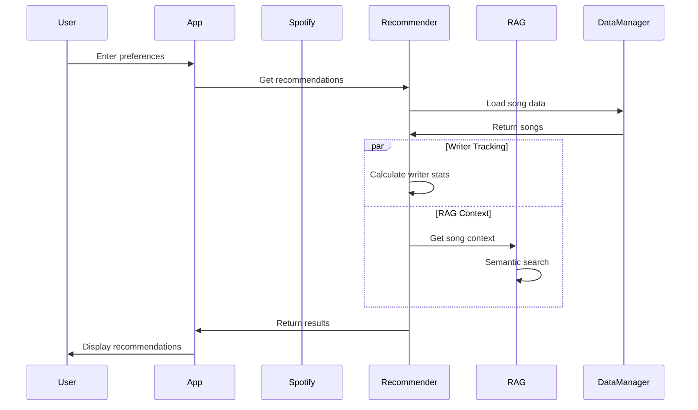

# System Architecture Diagram

```mermaid
flowchart TB
    subgraph Client["🎵 MelodyMind Web App"]
        UI[Streamlit UI]
        Nav[Navigation]
        Forms[Input Forms]
        Display[Results Display]
    end
    
    subgraph Spotify["🔗 Spotify Integration"]
        OAuth[OAuth Handler]
        API[Spotify API]
        Demo[Demo Mode]
    end
    
    subgraph Core["🎯 Core Recommendation Engine"]
        Rec[Music Recommender]
        Score[Scoring Algorithm]
        Writer[Writer Tracker]
        Params[Parameter Tuning]
    end
    
    subgraph Data["📊 Data Layer"]
        DM[Data Manager]
        Songs[Song Catalog]
        Writers[Writer Database]
    end
    
    subgraph RAG["🤖 RAG Engine"]
        Vector[Vector Store]
        Context[Context Retrieval]
        Search[Semantic Search]
    end
    
    subgraph Test["🧪 Testing & Reliability"]
        Harness[Test Harness]
        Conf[Confidence Scoring]
        Errors[Error Handling]
    end
    
    UI --> Nav
    Nav --> Forms
    Forms --> Rec
    Rec --> Score
    Score --> Params
    
    OAuth --> API
    Demo --> Rec
    
    Rec --> Writer
    Writer --> DM
    
    DM --> Songs
    DM --> Writers
    
    Rec --> Vector
    Vector --> Context
    Context --> Search
    
    Harness --> Conf
    Harness --> Errors
    Rec --> Harness
    
    Display <-- Rec
    Display <-- Writer
    Display <-- Context
```

## Data Flow

